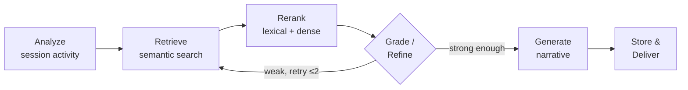

# TrailMind

**A behavioral AI recommendation agent for an AI model & tool catalog.**

TrailMind watches the trail an AI engineer leaves through a model catalog — searches, views,
comparisons — and reasons about where they're headed next. It retrieves relevant models via RAG +
vector search, then generates a grounded, comparison-driven recommendation that refreshes as
behavior evolves, with a scheduled digest and full pipeline tracing on top.

Originally built for the Krish Naik Hackathon 2026.

---

## Live demo

**[trailmind.onrender.com](https://trailmind.onrender.com)**

| Role | Email | Password |
|---|---|---|
| AI engineer | `engineer@trailmind.dev` | `engineer@123` |
| Curator / admin | `curator@trailmind.dev` | `admin@123` |

Hosted on Render's free tier, which spins the service down after ~15 minutes idle — the first hit
after idle can take 30–60s to wake up.

---

## What's inside

**Two-role platform.** Independent auth for AI engineers and curators — no admin
self-registration, server-side role checks on every admin route.

**A real catalog.** Full CRUD, dual-written to SQL and a Chroma vector store in the same request,
with a visible sync flag so a partial failure is never silent. Curators can also bulk-provision the
catalog from a CSV/JSON file instead of one row at a time.

**Behavioral tracking that doesn't spam the LLM.** Views, searches, comparisons, and dwell time
batch client-side and never call an LLM directly. A cheap event-count/cooldown check decides when
there's enough signal to actually run the agent.

**A real 6-node LangGraph pipeline** — `analyze → retrieve → rerank → grade/refine → generate →
store` — not a single prompt. Retrieval gets a bounded retry (max 2) when it comes back weak, and
generation still fires at most once per trigger regardless of how many retries that takes.

**Grounded, not generic, recommendations.** A "Because you looked at these" evidence row shows the
exact session activity behind a recommendation, and each candidate's "why this" tag is computed
deterministically from that evidence — never canned text. The current session dominates over older,
diluted history via geometric decay.

**A feedback loop that actually closes.** 👍/👎 on any recommendation re-ranks future retrieval
with an asymmetric penalty — but only carries forward to a future query that's genuinely similar to
the one the rating was given under, so one bad match can't wrongly suppress a model that's right for
a different query.

**Personalized picks inside the browsing flow.** The model detail drawer surfaces up to 3
alternatives from your live recommendation, filtered to exclude whatever's already open, with a
link back to the full picture — falling back to content-based similarity when there's nothing
personalized yet.

**A scheduled digest**, not just an on-demand read — a real cron (APScheduler) re-runs the pipeline
per user and delivers via email or Telegram, with a logging fallback if neither is configured.

**Full observability.** Every pipeline run traces through LangSmith, with the admin console
separating our own step latency from LangGraph's internal tracing overhead, filtering by user, and
rolling up real Mesh cost/token/latency straight from stored data.

**A curator console** beyond the catalog: a usage-metrics overview (totals, event mix, feedback
sentiment, live activity), a Users list, and bulk catalog upload — all paginated.

---

## Architecture

One FastAPI process serves both the JSON API and the server-rendered frontend (Jinja2 + vanilla
JS) — no separate frontend build, no client framework. Two decoupled loops share the same storage:
a synchronous interaction loop that never calls an LLM, and an asynchronous recommendation loop
that does, exactly once per trigger.

```mermaid
flowchart TB
    user(["AI Engineer / Curator"])
    app["TrailMind\nsingle FastAPI process"]

    ui["Track & browse\nsync, no LLM"]
    trigger{{"Trigger check"}}
    pipeline["Recommendation pipeline\nLangGraph — async"]

    sql[("SQLite")]
    vector[("Chroma")]
    cron["Scheduler"]

    mesh["Mesh API"]
    trace["LangSmith"]
    notify["Email / Telegram"]

    user --> app
    app --> ui
    app --> trigger
    ui --> sql
    ui --> vector
    trigger -- fires --> pipeline
    trigger -. no fire .-> app
    pipeline --> sql
    pipeline --> vector
    cron -. daily sweep .-> pipeline
    pipeline --> mesh
    pipeline -.-> trace
    pipeline -.-> notify
    app --> user
```



The recommendation pipeline itself is a real LangGraph graph — six independently testable nodes,
with a bounded retry loop when retrieval comes back weak:



`Generate` is the only node that calls Mesh — at most once per trigger, regardless of how many
retries the grading step takes.

---

## Key decisions & trade-offs

| Decision | Choice | Trade-off |
|---|---|---|
| Frontend | Jinja2 + vanilla JS | One container, no build step — simpler ops, less flexibility than a component framework. |
| Background work | FastAPI `BackgroundTasks` | Right-sized for this scale; a real queue (Celery/Redis) is the upgrade path once traffic demands it. |
| LLM cost control | ≤1 Mesh call per trigger, never blocking | Ingestion stays ~50ms even under load — enforced by the graph's structure, not a convention. |
| Vector store | Chroma, local file | Zero external account/API key needed — removes setup friction for anyone running the repo. |
| Hosting | Render over Vercel | This app needs a persistent disk and an always-on cron — Vercel's serverless model has neither without a re-architecture. |
| Observability | Pipeline time reported separately from tracing overhead | A more honest latency number, at the cost of one extra aggregation query per page load. |
| Feedback | Context-scoped, not global | A bad match on one query can't wrongly suppress a model that's right for a different one. |

---

## Quick start

```bash
git clone <this repo>
cd smartreco-hackathon
uv sync
source .venv/bin/activate      # Windows: .venv\Scripts\activate
cp .env.example .env           # fill in MESH_API_KEY=rsk_...
uv run python seed_data.py
uv run uvicorn app.asgi:app --reload --port 8001
```

Open <http://localhost:8001> — seeded demo logins are the same as the [live demo](#live-demo)
above. Without a `MESH_API_KEY`, the app still runs end to end — the dashboard honestly stays in
retrieval-ready mode (real Chroma retrieval, no fabricated narrative) instead of faking output.

**One-command dev server:**

```bash
./scripts/start_dev.sh          # start (detached) and tail the log
./scripts/start_dev.sh stop
./scripts/start_dev.sh restart
./scripts/start_dev.sh status
```

**Tests:**

```bash
pytest
```

---

## Deploying

[Render](https://render.com) is the target this repo is configured for — a persistent disk + an
always-on process, closest to "push this repo, get a URL." `render.yaml` (repo root) is a
ready-to-use [Blueprint](https://render.com/docs/blueprint-spec):

1. Push this repo to GitHub.
2. Render dashboard → **New → Blueprint** → select this repo. Render reads `render.yaml` and
   proposes the service.
3. Fill in the env vars marked `sync: false` — at minimum `MESH_API_KEY`. Leave
   `SMTP_*`/`TELEGRAM_*`/`LANGSMITH_API_KEY` blank and those features gracefully degrade (logged-
   only digest, no tracing) exactly like they do locally.
4. Deploy. `startCommand` re-runs `seed_data.py` on every boot, so the demo catalog and demo
   accounts are always present — even after a redeploy wipes the disk (see below).

**Free plan limitations**, documented in `render.yaml` too:
- **Ephemeral disk** — every redeploy wipes the database and vector store back to just the seeded
  demo data. A persistent Disk (commented block in `render.yaml`) fixes this but requires a paid
  instance type.
- **Spins down after ~15 min idle**, waking on the next request in 30–60s.

We couldn't fit this app onto Vercel without a re-architecture: it's serverless/edge (no
persistent disk, no always-on process), and this app depends on both — SQLite and Chroma as local
files needing durable writes, and a daily digest cron that needs a continuously running process to
live in.

---

## Project structure

```
smartreco-hackathon/
├── docs/                  # design/planning docs — domain decision, requirements, HLD/LLD, test strategy
├── app/
│   ├── main.py             # routes, app wiring, scheduler registration
│   ├── models.py           # SQLAlchemy schema
│   ├── vector.py           # Chroma wrapper (dual-write, metadata filtering)
│   ├── services/
│   │   ├── agent_graph.py    # the 6-node LangGraph pipeline
│   │   ├── recommendation.py # trigger check, behavior summary, activity hash
│   │   ├── mesh.py           # Mesh API client (the only LLM call boundary)
│   │   ├── digest.py         # scheduled digest + notifier abstraction
│   │   ├── tracing.py        # LangSmith opt-in wiring
│   │   └── observability.py  # admin-portal LangSmith run viewer
│   ├── templates/           # Jinja2 per-screen templates extending base.html
│   └── static/{css,js}/     # shared styling + frontend logic
├── tests/                 # pytest suite
├── seed_data.py            # demo users + curated model catalog
├── requirements.txt
├── .env.example
└── render.yaml
```

---

## Known limitations

- **Free-tier hosting.** Ephemeral disk and idle spin-down — see [Deploying](#deploying).
- **Telegram digest** is per-user (set from the dashboard); falls back to a single shared broadcast
  chat if configured, or is skipped (logged, not silently dropped) if neither exists.
- **Embeddings** use real semantic vectors via Mesh when configured; a deterministic hashed
  bag-of-words fallback keeps the app fully functional without a key, at weaker paraphrase recall.
- **`recommendation_triggered`** in the events API reflects whether the pipeline was queued, not
  whether generation will succeed — that part only resolves in the background, by design.

---

## Further reading

Design and planning docs live in [`docs/`](docs/) — domain decision, business/functional
requirements, UX flows, architecture, schema/API contracts, and test strategy, in that order.

---

*TrailMind — FastAPI · LangGraph · Chroma · Mesh API*
