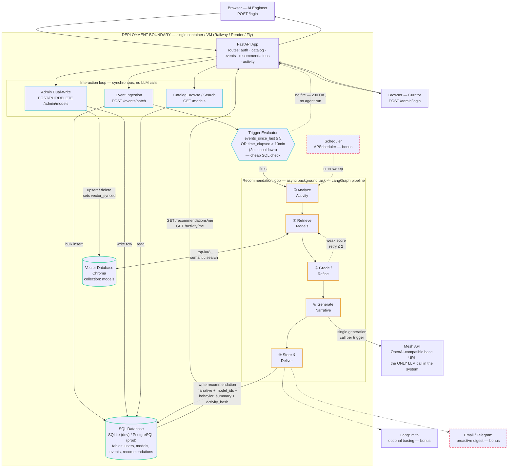

# SmartReco — Technical Architecture Diagram

Component-level view: where each piece runs, which database/vector store it talks to, and how
requests flow end to end — client, through the deployment boundary, to the external LLM call, and
back.

> **Living document.** This reflects the design as of the current planning/build phase. Update it
> as the architecture evolves — especially once real deployment infra (hosting target, secrets
> store, CI/CD) is decided — rather than letting it drift from what's actually built.

## Legend

| Style | Meaning |
|---|---|
| Cyan border | Interaction loop — synchronous, cheap, never calls an LLM |
| Amber border | Recommendation loop — async background task, the one path that calls an LLM |
| Teal border, cylinder shape | Data store (SQL or vector) |
| Violet border | External service (outside the deployment boundary) |
| Rose dashed border | Bonus / optional (scheduler, digest, LangSmith) |
| Diamond | Decision point (trigger evaluator) |
| Dashed arrow | Optional or conditional path |

## Component-to-storage map

| Component | Reads | Writes |
|---|---|---|
| Event ingestion | — | SQL `events` |
| Admin dual-write | — | SQL `models`, Chroma `models` collection |
| Catalog browse/search | SQL `models` | — |
| Trigger evaluator | SQL `recommendations`, `events` | — |
| `analyze_activity` | SQL `events`, `recommendations` (last hash) | — |
| `retrieve_models` | Chroma `models` collection | — |
| `generate_narrative` | — | Mesh API (external call) |
| `store_and_deliver` | — | SQL `recommendations` |
| Dashboard / Activity read | SQL `recommendations`, `events` | — |

Full requirement-level detail (schema DDL, API contracts, per-node input/output) stays in
[`06-LLD.md`](06-LLD.md); this diagram is the visual index into that document, not a replacement
for it.
