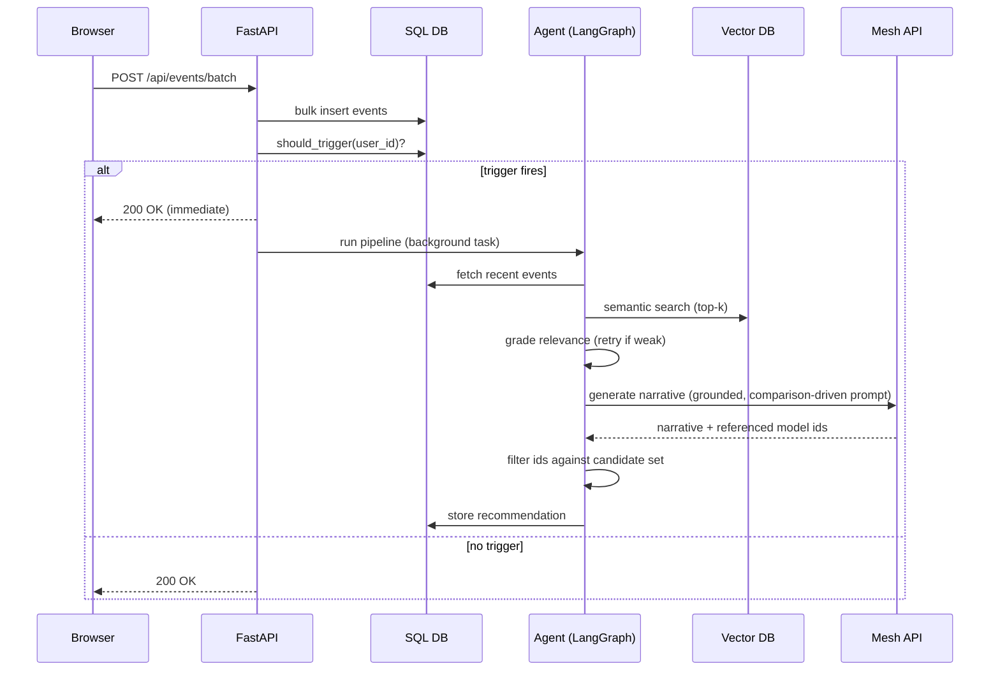
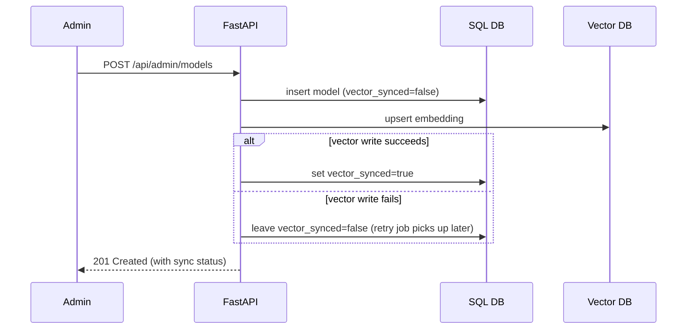

# Low-Level Design (LLD)
## SmartReco

## 1. Database schema (SQLAlchemy / DDL-equivalent)

```sql
CREATE TABLE users (
  id            INTEGER PRIMARY KEY,
  email         TEXT UNIQUE NOT NULL,
  password_hash TEXT NOT NULL,
  role          TEXT NOT NULL DEFAULT 'user',   -- 'user' | 'admin'
  created_at    TIMESTAMP NOT NULL DEFAULT CURRENT_TIMESTAMP
);

CREATE TABLE models (
  id             INTEGER PRIMARY KEY,
  title          TEXT NOT NULL,
  description    TEXT NOT NULL,     -- plain technical summary: what the model does
  story          TEXT,              -- curator's pitch: who should pick it, what trade-off it makes
  provider       TEXT NOT NULL,     -- 'OpenAI' | 'Anthropic' | 'ElevenLabs' | ...
  modality       TEXT NOT NULL,     -- 'LLM' | 'Voice' | 'Image' | 'Video' | 'Embedding' | 'Multimodal'
  price          NUMERIC NOT NULL,  -- cost per unit; unit documented in description (e.g. per 1M tokens, per char)
  latency_ms     INTEGER,
  context_window INTEGER,
  use_case_tags  JSON,              -- e.g. ["real-time voice", "customer support"]
  source_url     TEXT,              -- provenance for curated specs, shown to judges on request
  vector_synced  BOOLEAN NOT NULL DEFAULT FALSE,
  created_at     TIMESTAMP NOT NULL DEFAULT CURRENT_TIMESTAMP,
  updated_at     TIMESTAMP NOT NULL DEFAULT CURRENT_TIMESTAMP
);

CREATE TABLE events (
  id          INTEGER PRIMARY KEY,
  user_id     INTEGER NOT NULL REFERENCES users(id),
  event_type  TEXT NOT NULL,        -- 'page_view' | 'model_view' | 'search' | 'click' | 'model_compare' | 'dwell'
  model_id    INTEGER REFERENCES models(id),
  metadata    JSON,                 -- e.g. {"query": "...", "dwell_ms": 4200, "compared_model_ids": [7, 12]}
  created_at  TIMESTAMP NOT NULL DEFAULT CURRENT_TIMESTAMP
);
CREATE INDEX idx_events_user_time ON events(user_id, created_at);

CREATE TABLE recommendations (
  id                INTEGER PRIMARY KEY,
  user_id           INTEGER NOT NULL REFERENCES users(id),
  narrative         TEXT NOT NULL,
  model_ids         JSON NOT NULL,     -- ["12", "7", "31"]
  behavior_summary  TEXT NOT NULL,     -- the analyze_activity output that produced this rec (DLV-4)
  activity_hash     TEXT NOT NULL,     -- hash of the event signature that produced this rec
  trigger_reason    TEXT NOT NULL,     -- 'event_count' | 'time_elapsed' | 'scheduled_digest'
  created_at        TIMESTAMP NOT NULL DEFAULT CURRENT_TIMESTAMP
);
CREATE INDEX idx_reco_user_time ON recommendations(user_id, created_at);
```

Vector store (Chroma) — one collection `models` (configurable via `CHROMA_COLLECTION_NAME`).
Embeddings are real Mesh embeddings (`MESH_EMBEDDING_MODEL`, default `google/embeddinggemma-300m`,
768-dim) whenever `MESH_API_KEY` is set, falling back to a deterministic hashed bag-of-words
embedding (`EMBEDDING_DIMENSION`, default 64) otherwise — see `app/vector.py:build_embedding_
function`. Switching between them (or changing `EMBEDDING_DIMENSION`) invalidates already-indexed
vectors; re-run `seed_data.py`/re-upsert existing catalog rows after. Document
id = `models.id` (string), embedding
input = `f"{title}. {provider}. {modality}. {description}. {story}"` (the story field is included
because it carries use-case/trade-off language that closely matches how builders phrase what
they're looking for), metadata = `{"provider": ..., "modality": ..., "price": ..., "latency_ms": ...}`.

---

## 2. API contract

| Method | Path | Auth | Purpose |
|---|---|---|---|
| POST | `/api/auth/register` | none | AUTH-1, AI engineer self-registration only — always creates role `user` |
| POST | `/api/auth/login` | none | AUTH-2, AI engineer login, returns session/JWT |
| POST | `/api/admin/login` | none | AUTH-5 + AUTH-6, admin-only login, returns session/JWT with role `admin`; no `/api/admin/register` exists |
| GET | `/api/auth/me` | user | Current session's own profile (includes `telegram_chat_id`) |
| PUT | `/api/auth/me/telegram-chat-id` | user | DLV-3 bonus follow-up: self-serve per-user Telegram digest chat ID, read by `TelegramNotifier` |
| GET | `/api/models` | none | CAT-5, list/search catalog (filter by modality/provider) |
| GET | `/api/models/{id}` | none | model detail |
| POST | `/api/admin/models` | admin | CAT-1 + dual-write |
| PUT | `/api/admin/models/{id}` | admin | CAT-2 + re-sync |
| DELETE | `/api/admin/models/{id}` | admin | CAT-3 + vector delete |
| POST | `/api/events/batch` | user | TRK-4, body: `{events: [...]}`, triggers evaluator inline |
| GET | `/api/recommendations/me` | user | DLV-1, latest stored recommendation |
| GET | `/api/activity/me` | user | DLV-4, recent raw events + the `behavior_summary`/`activity_hash`/`trigger_reason` chain behind the latest recommendation — read-only, no new write path |
| GET | `/api/admin/observability/runs` | admin | OBS-2, recent `agent_pipeline` LangSmith runs (status/latency/error/trace link), read-only proxy over the LangSmith API; returns `{"available": false, ...}` rather than an error when `LANGSMITH_API_KEY` is unset |

`/api/auth/*` and `/api/admin/login` are separate router modules sharing the same `users` table and
password-hashing logic, but not the same route or handler — the AI engineer module can never issue an
`admin` role, and the admin module has no register counterpart. Admin accounts are created only via
the seed script or an authenticated admin user-management action.

### 2a. Page routes (server-rendered, Jinja2)

Separate from the JSON API above — these return HTML pages, each a real, bookmarkable route (not a
client-side view toggle). See `docs/08-Build-Status.md`'s frontend routing migration task for the
implementation checklist.

| Route | Template | Auth |
|---|---|---|
| GET `/login` | `login.html` | none |
| GET `/admin/login` | `admin_login.html` | none |
| GET `/` or `/catalog` | `catalog.html` | AI engineer (public browse allowed; personalized recs require login) |
| GET `/models/{id}` | `model_detail.html` | AI engineer |
| GET `/compare` | `compare.html` — reads selection from `?ids=12,7`, a real shareable comparison link | AI engineer |
| GET `/dashboard` | `dashboard.html` | AI engineer |
| GET `/activity` | `activity.html` | AI engineer |
| GET `/admin` | `admin.html` | curator |
| GET `/admin/observability` | `observability.html` | curator |

Auth-gating on these routes is server-side (redirect to `/login` or `/admin/login` on a missing or
wrong-role session cookie) — not merely a client-side nav toggle.

**POST /api/events/batch — request**
```json
{
  "events": [
    {"event_type": "model_view", "model_id": 12, "metadata": {"dwell_ms": 4200}},
    {"event_type": "search", "metadata": {"query": "real-time voice"}},
    {"event_type": "model_compare", "metadata": {"compared_model_ids": [12, 7]}}
  ]
}
```

**GET /api/recommendations/me — response**
```json
{
  "narrative": "You've been comparing low-latency voice models all week...",
  "models": [
    {"id": 12, "title": "ElevenLabs Turbo v2", "reason": "viewed 3 times"},
    {"id": 31, "title": "PlayHT", "reason": "matched search: real-time voice"}
  ],
  "generated_at": "2026-08-01T14:03:00Z"
}
```

**GET /api/activity/me — response**
```json
{
  "events": [
    {"type": "model_view", "model": "ElevenLabs Turbo v2.5", "at": "14:02:11", "metadata": {"dwell_ms": 41000}},
    {"type": "search", "query": "real-time voice", "at": "14:02:58"},
    {"type": "model_compare", "models": ["ElevenLabs Turbo v2.5", "PlayHT Play 3.0"], "at": "14:04:20"}
  ],
  "pipeline": {
    "events_since_last": 6,
    "trigger_reason": "event_count",
    "behavior_summary": "evaluating low-latency voice models",
    "activity_hash": "a91f...02c4",
    "delivered_at": "2026-08-01T14:09:20Z"
  }
}
```
Both arrays are read straight from `events` and `recommendations` — no synthetic or hardcoded data,
which is what makes this screen usable as grounding proof rather than a mocked-up debug view.

---

## 3. Trigger evaluator (pseudocode)

```python
def should_trigger(user_id: int) -> tuple[bool, str]:
    last = get_last_recommendation(user_id)
    events_since = count_events_since(user_id, last.created_at if last else None)
    cooldown_ok = not last or (now() - last.created_at) > timedelta(minutes=2)

    if not cooldown_ok:
        return False, ""
    if events_since >= 5:
        return True, "event_count"
    if last and (now() - last.created_at) > timedelta(minutes=10) and events_since > 0:
        return True, "time_elapsed"
    return False, ""
```

Called synchronously (cheap, pure SQL) at the end of `/api/events/batch`; if it returns `True`, a
background task is scheduled — the HTTP response to the browser is not blocked on the agent run.

**Evaluation clustering (feeds `analyze_activity`, not a trigger rule):** in the same pass that
aggregates recent events, group `model_view` events by modality; if 2+ *distinct* models of the
same modality were viewed within a 15-minute window, fold that into the behavior summary as a soft
signal (e.g. "browsing multiple voice models"). This is separate from `model_compare` (TRK-6, which
only fires on the explicit "add to comparison" action) — clustering never produces a "you compared
X vs Y" claim, only a softer "you've been evaluating this modality" one.

---

## 4. LangGraph node contracts

| Node | Input | Output | Notes |
|---|---|---|---|
| `analyze_activity` | `user_id` | `behavior_summary: str`, `activity_hash: str` | Pulls last N events, aggregates by modality/provider/query; reads explicit `model_compare` events for high-confidence "X vs Y" pairs, and separately applies same-modality view clustering (see §3) for a softer evaluation signal; if `activity_hash` matches last stored recommendation's hash, short-circuit the graph (AGT-6) |
| `retrieve_models` | `behavior_summary` | `candidates: list[{id, title, score, metadata}]` | Embeds a retrieval query from the summary, queries Chroma top-k=8 |
| `rerank_candidates` | `candidates` (dense-ranked) | `candidates` (re-ordered) | Hybrid dense+sparse re-rank (bonus, retrieval polish): blends each candidate's Chroma distance with lexical term overlap against its own catalog document text (`app/vector.py:ModelVectorStore.document`); additive bonus capped at `RERANK_LEXICAL_BONUS`, no LLM/network call |
| `grade_refine` | `candidates`, retry count | `candidates` (possibly re-retrieved) or `refined_query` | If max(score) < threshold and retries < 2, rewrite query (broaden modality / drop over-specific term) and loop back to `retrieve_models` (which re-runs `rerank_candidates` on the new results) |
| `generate_narrative` | `behavior_summary`, `candidates` | `narrative: str`, `model_ids: list[str]` | Mesh API call; prompt instructs the model to produce a comparison-driven narrative referencing **only** provided candidate IDs (e.g. contrasting price/latency); response is validated post-hoc — any ID not in `candidates` is dropped before storage |
| `store_and_deliver` | `narrative`, `model_ids`, `activity_hash`, `trigger_reason` | — | Writes `recommendations` row; (bonus) enqueues email/Telegram send |

Grounding guard (important for the "no hallucinated models" NFR): after `generate_narrative`
returns, filter `model_ids` against the candidate set server-side before persisting — never trust
the LLM's IDs blindly.

---

## 5. Sequence — recommendation generation



## 6. Sequence — admin model dual-write


