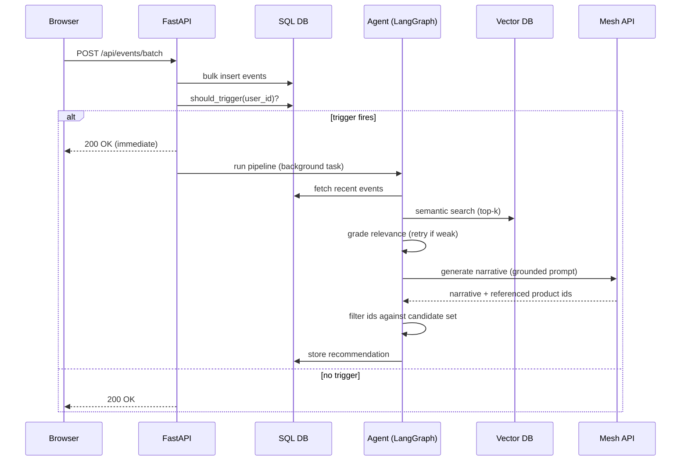

# Low-Level Design (LLD)
## SmartReco

## 1. Database schema (SQLAlchemy / DDL-equivalent)

```sql
CREATE TABLE users (
  id            INTEGER PRIMARY KEY,
  email         TEXT UNIQUE NOT NULL,
  password_hash TEXT NOT NULL,
  role          TEXT NOT NULL DEFAULT 'user',   -- 'user' | 'admin'
  created_at    TIMESTAMP NOT NULL DEFAULT CURRENT_TIMESTAMP
);

CREATE TABLE products (
  id             INTEGER PRIMARY KEY,
  title          TEXT NOT NULL,
  description    TEXT NOT NULL,
  category       TEXT NOT NULL,
  price          NUMERIC NOT NULL,
  vector_synced  BOOLEAN NOT NULL DEFAULT FALSE,
  created_at     TIMESTAMP NOT NULL DEFAULT CURRENT_TIMESTAMP,
  updated_at     TIMESTAMP NOT NULL DEFAULT CURRENT_TIMESTAMP
);

CREATE TABLE events (
  id          INTEGER PRIMARY KEY,
  user_id     INTEGER NOT NULL REFERENCES users(id),
  event_type  TEXT NOT NULL,        -- 'page_view' | 'product_view' | 'search' | 'click' | 'dwell'
  product_id  INTEGER REFERENCES products(id),
  metadata    JSON,                 -- e.g. {"query": "...", "dwell_ms": 4200}
  created_at  TIMESTAMP NOT NULL DEFAULT CURRENT_TIMESTAMP
);
CREATE INDEX idx_events_user_time ON events(user_id, created_at);

CREATE TABLE recommendations (
  id             INTEGER PRIMARY KEY,
  user_id        INTEGER NOT NULL REFERENCES users(id),
  narrative      TEXT NOT NULL,
  product_ids    JSON NOT NULL,     -- ["12", "7", "31"]
  activity_hash  TEXT NOT NULL,     -- hash of the event signature that produced this rec
  trigger_reason TEXT NOT NULL,     -- 'event_count' | 'time_elapsed' | 'scheduled_digest'
  created_at     TIMESTAMP NOT NULL DEFAULT CURRENT_TIMESTAMP
);
CREATE INDEX idx_reco_user_time ON recommendations(user_id, created_at);
```

Vector store (Chroma) — one collection `products`, document id = `products.id` (string), embedding
input = `f"{title}. {category}. {description}"`, metadata = `{"category": ..., "price": ...}`.

---

## 2. API contract

| Method | Path | Auth | Purpose |
|---|---|---|---|
| POST | `/api/auth/register` | none | AUTH-1 |
| POST | `/api/auth/login` | none | AUTH-2, returns session/JWT |
| GET | `/api/products` | none | CAT-5, list/search catalog |
| GET | `/api/products/{id}` | none | product detail |
| POST | `/api/admin/products` | admin | CAT-1 + dual-write |
| PUT | `/api/admin/products/{id}` | admin | CAT-2 + re-sync |
| DELETE | `/api/admin/products/{id}` | admin | CAT-3 + vector delete |
| POST | `/api/events/batch` | user | TRK-4, body: `{events: [...]}`, triggers evaluator inline |
| GET | `/api/recommendations/me` | user | DLV-1, latest stored recommendation |

**POST /api/events/batch — request**
```json
{
  "events": [
    {"event_type": "product_view", "product_id": 12, "metadata": {"dwell_ms": 4200}},
    {"event_type": "search", "metadata": {"query": "multi-agent"}}
  ]
}
```

**GET /api/recommendations/me — response**
```json
{
  "narrative": "You've been circling back to agentic AI content all week...",
  "products": [
    {"id": 12, "title": "Agentic AI Fundamentals", "reason": "viewed 3 times"},
    {"id": 31, "title": "LangGraph 101", "reason": "matched search: multi-agent"}
  ],
  "generated_at": "2026-08-01T14:03:00Z"
}
```

---

## 3. Trigger evaluator (pseudocode)

```python
def should_trigger(user_id: int) -> tuple[bool, str]:
    last = get_last_recommendation(user_id)
    events_since = count_events_since(user_id, last.created_at if last else None)
    cooldown_ok = not last or (now() - last.created_at) > timedelta(minutes=2)

    if not cooldown_ok:
        return False, ""
    if events_since >= 5:
        return True, "event_count"
    if last and (now() - last.created_at) > timedelta(minutes=10) and events_since > 0:
        return True, "time_elapsed"
    return False, ""
```

Called synchronously (cheap, pure SQL) at the end of `/api/events/batch`; if it returns `True`, a
background task is scheduled — the HTTP response to the browser is not blocked on the agent run.

---

## 4. LangGraph node contracts

| Node | Input | Output | Notes |
|---|---|---|---|
| `analyze_activity` | `user_id` | `behavior_summary: str`, `activity_hash: str` | Pulls last N events, aggregates by category/query; if `activity_hash` matches last stored recommendation's hash, short-circuit the graph (AGT-6) |
| `retrieve_products` | `behavior_summary` | `candidates: list[{id, title, score, metadata}]` | Embeds a retrieval query from the summary, queries Chroma top-k=8 |
| `grade_refine` | `candidates`, retry count | `candidates` (possibly re-retrieved) or `refined_query` | If max(score) < threshold and retries < 2, rewrite query (broaden category / drop over-specific term) and loop back to `retrieve_products` |
| `generate_narrative` | `behavior_summary`, `candidates` | `narrative: str`, `product_ids: list[str]` | Mesh API call; prompt instructs the model to reference **only** provided candidate IDs; response is validated post-hoc — any ID not in `candidates` is dropped before storage |
| `store_and_deliver` | `narrative`, `product_ids`, `activity_hash`, `trigger_reason` | — | Writes `recommendations` row; (bonus) enqueues email/Telegram send |

Grounding guard (important for the "no hallucinated products" NFR): after `generate_narrative`
returns, filter `product_ids` against the candidate set server-side before persisting — never trust
the LLM's IDs blindly.

---

## 5. Sequence — recommendation generation



## 6. Sequence — admin product dual-write


