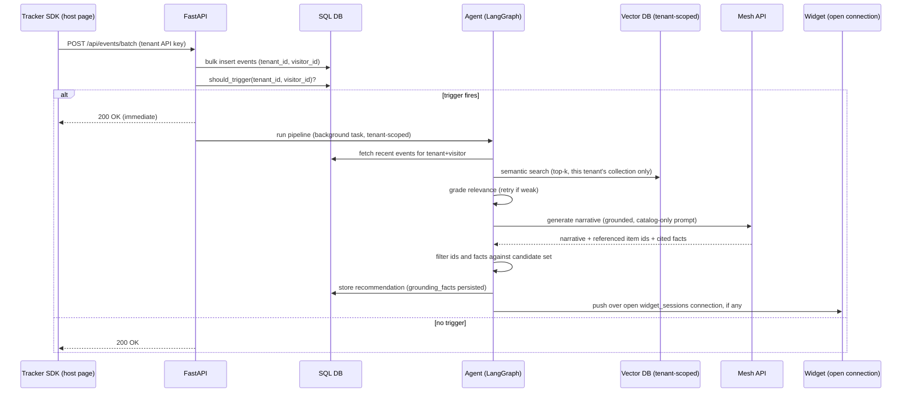
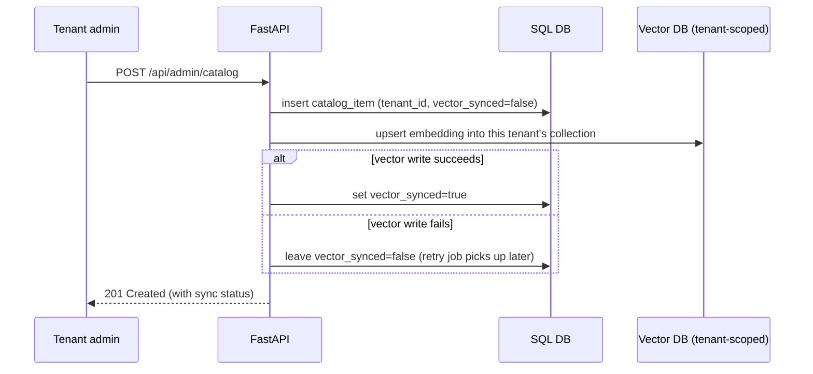
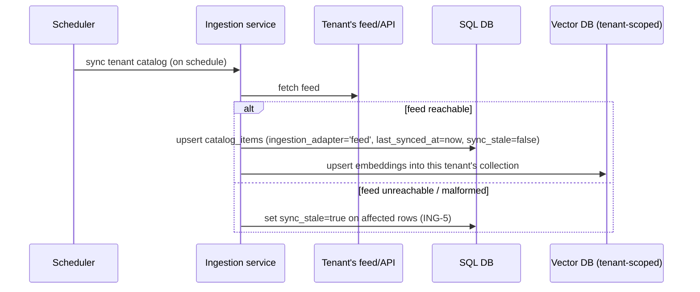

# Low-Level Design (LLD)
## TrailMind — Embeddable Behavioral Recommendation Platform

Updated per [`09-Platform-Pivot-Decision.md`](09-Platform-Pivot-Decision.md). The schema, API
contract, and LangGraph node contracts below add a `tenants` table and `tenant_id` scoping
throughout, plus new tables/endpoints for catalog ingestion adapters and real-time push sessions.
Everything not shown as changed keeps its hackathon-era shape (dual-write pattern, trigger
evaluator logic, node contracts) — the pivot generalizes it, it doesn't replace it.

## 1. Database schema (SQLAlchemy / DDL-equivalent)

**Implementation status note:** the `events`/`recommendations` shape below (with
`visitor_id TEXT NOT NULL` replacing `user_id`, an anonymous tracker-assigned identity) is the
*target* shape once the tracker SDK ships. Phase 1 of the pivot (multi-tenant foundation —
`tenants`, `tenant_id` scoping, per-tenant Chroma collections) deliberately kept `user_id` as the
authenticated-engineer identity rather than also introducing anonymous visitors in the same change
— see `docs/design/09-Platform-Pivot-Decision.md`. `catalog_items`/`category`/`subcategory`/
`attributes` (the entity generalization beyond the AI-model domain) are similarly not yet
implemented; the running code still uses `models`/`provider`/`modality`. M4 (2026-09-09) landed the
`ingestion_adapter`/`review_status`/`last_synced_at`/`sync_stale` columns on the real `models` table
as-is (see below), plus one addition not shown here: an `ingestion_meta JSON` column holding
adapter-specific provenance (scrape source page/markup-type, since no `attributes`-style JSON bag
exists yet to fold it into) and `tenants.feed_url`/`feed_auth_token` for ING-1's feed config. Treat
this section as the target schema, and `app/models.py` as the current one, until those phases land.

```sql
CREATE TABLE tenants (                                -- new
  id                    INTEGER PRIMARY KEY,
  name                  TEXT NOT NULL,
  status                TEXT NOT NULL DEFAULT 'onboarding',  -- 'onboarding' | 'active' | 'suspended' -- readiness gate (TEN-8): widget stays dormant on the host page until 'active'
  allowed_origins       JSON NOT NULL,       -- CORS allowlist for the tracker SDK (soft defense only -- see 09-Platform-Pivot-Decision.md §5)
  max_agent_runs_per_hour INTEGER NOT NULL DEFAULT 500,  -- new: hard per-tenant LLM-run ceiling, independent of the per-visitor AGT-1 cooldown -- closes the fabricated-visitor-id bypass (09-Platform-Pivot-Decision.md §5)
  created_at            TIMESTAMP NOT NULL DEFAULT CURRENT_TIMESTAMP
);

CREATE TABLE tenant_api_keys (                        -- new -- the key itself is public-ish (ships in tracker snippet page source, like a Stripe publishable key), so its safety is scope + rate limits, not secrecy
  id          INTEGER PRIMARY KEY,
  tenant_id   INTEGER NOT NULL REFERENCES tenants(id),
  key_hash    TEXT NOT NULL,           -- raw key shown once at creation/rotation (TEN-1/TEN-5), only the hash persisted
  status      TEXT NOT NULL DEFAULT 'active',  -- 'active' | 'grace' | 'revoked' -- rotation keeps old key valid in 'grace' for ~24h so an already-deployed snippet doesn't break mid-rotation
  expires_at  TIMESTAMP,               -- set when a key enters 'grace'; null for 'active'
  created_at  TIMESTAMP NOT NULL DEFAULT CURRENT_TIMESTAMP
);
CREATE INDEX idx_tenant_api_keys_tenant ON tenant_api_keys(tenant_id, status);

CREATE TABLE users (
  id            INTEGER PRIMARY KEY,
  tenant_id     INTEGER NOT NULL REFERENCES tenants(id),   -- new
  email         TEXT NOT NULL,
  password_hash TEXT NOT NULL,
  role          TEXT NOT NULL DEFAULT 'user',   -- 'user' | 'tenant_admin' | 'platform_admin'
  created_at    TIMESTAMP NOT NULL DEFAULT CURRENT_TIMESTAMP,
  UNIQUE (tenant_id, email)              -- was UNIQUE(email); now unique per tenant, not globally
);

CREATE TABLE catalog_items (                           -- was: models
  id             INTEGER PRIMARY KEY,
  tenant_id      INTEGER NOT NULL REFERENCES tenants(id),   -- new
  title          TEXT NOT NULL,
  description    TEXT NOT NULL,     -- plain technical summary: what the item does
  story          TEXT,              -- pitch copy: who should pick it, what trade-off it makes
  category       TEXT NOT NULL,     -- generalizes 'provider' — tenant-defined grouping (e.g. issuer, provider)
  subcategory    TEXT NOT NULL,     -- generalizes 'modality' — tenant-defined type (e.g. card tier, model type)
  price          NUMERIC,           -- optional now; not every catalog has a per-unit price (e.g. a card's fee structure lives in attributes)
  attributes     JSON,              -- tenant-defined structured facts (e.g. {"apr": "18.99%", "annual_fee": 0} or {"latency_ms": 220, "context_window": 128000}) — the only source the bot may cite numbers from (AGT-5/AGT-8)
  use_case_tags  JSON,
  source_url     TEXT,              -- provenance, kept for the manual/feed adapters
  ingestion_adapter TEXT NOT NULL,  -- new: 'feed' | 'scrape' | 'manual' (ING-1/2/3)
  review_status  TEXT NOT NULL DEFAULT 'approved',  -- new: 'pending_review' | 'approved' -- scrape-adapter rows start 'pending_review' (ING-6) and are excluded from retrieval until a tenant admin confirms them; feed/manual rows default 'approved'
  last_synced_at TIMESTAMP,         -- new: ING-5 staleness tracking
  sync_stale     BOOLEAN NOT NULL DEFAULT FALSE,  -- new: ING-5
  vector_synced  BOOLEAN NOT NULL DEFAULT FALSE,
  created_at     TIMESTAMP NOT NULL DEFAULT CURRENT_TIMESTAMP,
  updated_at     TIMESTAMP NOT NULL DEFAULT CURRENT_TIMESTAMP
);
CREATE INDEX idx_catalog_tenant ON catalog_items(tenant_id);

CREATE TABLE events (
  id          INTEGER PRIMARY KEY,
  tenant_id   INTEGER NOT NULL REFERENCES tenants(id),   -- new
  visitor_id  TEXT NOT NULL,          -- was user_id FK; now an anonymous tracker-assigned id, not necessarily a users row (TRK-7: no PII)
  event_type  TEXT NOT NULL,          -- 'page_view' | 'item_view' | 'search' | 'click' | 'item_compare' | 'dwell'
  item_id     INTEGER REFERENCES catalog_items(id),
  metadata    JSON,                   -- e.g. {"query": "...", "dwell_ms": 4200, "compared_item_ids": [7, 12]}
  created_at  TIMESTAMP NOT NULL DEFAULT CURRENT_TIMESTAMP
);
CREATE INDEX idx_events_tenant_visitor_time ON events(tenant_id, visitor_id, created_at);

CREATE TABLE recommendations (
  id                INTEGER PRIMARY KEY,
  tenant_id         INTEGER NOT NULL REFERENCES tenants(id),   -- new
  visitor_id        TEXT NOT NULL,     -- was user_id FK; see events.visitor_id
  narrative         TEXT NOT NULL,
  item_ids          JSON NOT NULL,     -- ["12", "7", "31"]
  grounding_facts    JSON,             -- new (OBS-3): the attributes/fields actually cited from catalog_items, for audit
  behavior_summary  TEXT NOT NULL,
  activity_hash     TEXT NOT NULL,
  trigger_reason    TEXT NOT NULL,     -- 'event_count' | 'time_elapsed' | 'scheduled_digest'
  pushed_at         TIMESTAMP,         -- new (DLV-2): when real-time push to an open widget succeeded, null if none was open
  created_at        TIMESTAMP NOT NULL DEFAULT CURRENT_TIMESTAMP
);
CREATE INDEX idx_reco_tenant_visitor_time ON recommendations(tenant_id, visitor_id, created_at);

CREATE TABLE widget_sessions (                          -- new (DLV-2)
  id           INTEGER PRIMARY KEY,
  tenant_id    INTEGER NOT NULL REFERENCES tenants(id),
  visitor_id   TEXT NOT NULL,
  connection_id TEXT NOT NULL,       -- opaque id for the open SSE/WebSocket connection
  opened_at    TIMESTAMP NOT NULL DEFAULT CURRENT_TIMESTAMP,
  closed_at    TIMESTAMP
);
CREATE INDEX idx_widget_sessions_tenant_visitor ON widget_sessions(tenant_id, visitor_id, closed_at);
```

Vector store (Chroma) — one collection per tenant (`tenant_{id}_catalog`, or a shared collection
filtered by a `tenant_id` metadata field if tenant count grows large enough that per-tenant
collections become unwieldy — open choice, not yet decided). Embeddings are real Mesh embeddings
(`MESH_EMBEDDING_MODEL`, default `google/embeddinggemma-300m`, 768-dim) whenever `MESH_API_KEY` is
set, falling back to a deterministic hashed bag-of-words embedding (`EMBEDDING_DIMENSION`, default
64) otherwise — see `app/vector.py:build_embedding_function`. Switching between them (or changing
`EMBEDDING_DIMENSION`) invalidates already-indexed vectors per tenant; re-sync/re-upsert existing
catalog rows after. Document id = `catalog_items.id` (string), embedding input =
`f"{title}. {category}. {subcategory}. {description}. {story}"`, metadata =
`{"tenant_id": ..., "category": ..., "subcategory": ..., **attributes}`.

---

## 2. API contract

**Implementation status:** this table is the target contract for the full platform. The running app
has *removed* the AI-engineer routes this table never listed as current in the first place
(`POST /api/auth/register`, `POST /api/auth/login`, `GET /api/auth/me`,
`PUT /api/auth/me/telegram-chat-id`, the old cookie-session `POST /api/events/batch`,
`GET /api/recommendations/me`, `GET /api/activity/me`). Currently live: `POST /api/admin/login`,
`GET/POST/PUT/DELETE /api/admin/models*` and `GET /api/models*` (still admin-only pending a public/
tenant-key catalog *browsing* surface — this predates and is unrelated to the tracker key below),
`GET /api/admin/{overview,users,observability}*`, and — as of the tracker SDK phase — the anonymous
visitor-tracking path: `POST /api/track/events` (this table's target `POST /api/events/batch`, under
its actual implemented name and body shape — `{tenant_key, visitor_id, events}`, key in the body so
`navigator.sendBeacon` can carry it) and `GET /api/recommendations/latest` (implemented as
`tenant_key`+`visitor_id` query params, not yet the "visitor session (widget)" auth this table
describes — no widget-session mechanism exists until the chat-bot-widget phase). Tenant API-key
issuance/rotation/resolution (`create_tenant`/`issue_api_key`/`rotate_api_key`/`revoke_api_key`/
`resolve_tenant_by_api_key`, `app/services/tenants.py`) and the TEN-6 rate cap
(`tenant_rate_limited`) are implemented as service functions, called from a script/shell — the
`/api/tenants*` HTTP endpoints and admin console UI this table shows are not yet built. None of
`/api/widget/*` or `/api/admin/ingestion/*` exist yet. See `docs/design/09-Platform-Pivot-Decision.md`
and the session handoff notes for exactly what's built.

| Method | Path | Auth | Purpose |
|---|---|---|---|
| POST | `/api/tenants` | platform admin | TEN-1, onboard a tenant, issue API key (shown once) |
| POST | `/api/tenants/{id}/rotate-key` | tenant admin | TEN-5, issues a new `active` key, flips the previous one to `grace` with `expires_at = now + 24h` |
| POST | `/api/tenants/{id}/revoke-key/{key_id}` | tenant admin | TEN-5, immediate revoke (suspected leak) — bypasses the grace period, flips straight to `revoked` |
| POST | `/api/auth/register` | tenant API key | AUTH-1, end-user self-registration for that tenant — always creates role `user` |
| POST | `/api/auth/login` | tenant API key | AUTH-2, end-user login, returns session/JWT carrying `tenant_id` |
| POST | `/api/admin/login` | none | AUTH-5 + AUTH-6, tenant-admin login, returns session/JWT with an admin role; no `/api/admin/register` exists |
| GET | `/api/auth/me` | user | Current session's own profile |
| GET | `/api/catalog` | tenant API key or public (tenant-configurable) | CAT-5, list/search that tenant's catalog (filter by category/subcategory) |
| GET | `/api/catalog/{id}` | tenant API key or public | catalog item detail |
| POST | `/api/admin/catalog` | tenant admin | CAT-1 + dual-write, manual-entry adapter (ING-3) |
| PUT | `/api/admin/catalog/{id}` | tenant admin | CAT-2 + re-sync |
| DELETE | `/api/admin/catalog/{id}` | tenant admin | CAT-3 + vector delete |
| POST | `/api/admin/catalog/bulk-upload` | tenant admin | CSV/JSON catalog import, `multipart/form-data`, same dual-write path as manual create; per-row report, never aborts the batch on one bad row |
| POST | `/api/admin/ingestion/feed` | tenant admin | ING-1, configure a feed/API-pull adapter (URL, optional bearer token) |
| POST | `/api/admin/ingestion/feed/sync` | tenant admin | ING-1, manual re-sync on top of the hourly scheduled sweep; failure marks existing feed rows `sync_stale` (ING-5) rather than raising past the caller |
| POST | `/api/admin/ingestion/scrape/preview` | tenant admin | ING-2, fetches a page and extracts candidate rows (schema.org/JSON-LD first, tenant CSS selectors as fallback) without persisting anything |
| POST | `/api/admin/ingestion/scrape/confirm` | tenant admin | ING-2/ING-6, persists a previewed set as `review_status='pending_review'` |
| POST | `/api/admin/catalog/{id}/approve` | tenant admin | ING-6, flips a `pending_review` row to `approved`, making it eligible for retrieval/vector-indexing for the first time |
| GET | `/api/admin/ingestion/status` | tenant admin | ING-5, per-adapter row count/last-synced timestamp/staleness flag/pending-review count |

**Implementation status (M4, 2026-09-09):** the row above shows the endpoints actually
built — a `preview`/`confirm` pair for scrape rather than the single `POST
.../ingestion/scrape` this table originally sketched, since a tenant admin needs to see
extracted rows before anything is written (ING-6). The `/admin/ingestion` admin-console
page (§2a below) is not yet built — these endpoints are API-only for now, same posture
Phase 1's tenant-key issuance had before its own HTTP surface landed.
| GET | `/api/admin/users` | tenant admin | Read-only list of that tenant's registered accounts — admin-portal visibility into who has registered |
| POST | `/api/events/batch` | tenant API key, cross-origin | TRK-4, body: `{visitor_id, events: [...]}`, triggers evaluator inline, scoped to `tenant_id` + `visitor_id` |
| GET | `/api/recommendations/latest` | visitor session (widget) | Latest stored recommendation for this tenant+visitor — read fallback when no push connection is open |
| GET | `/api/widget/stream` | visitor session (widget), tenant API key | DLV-2, opens the SSE/WebSocket connection the real-time push service delivers on; creates a `widget_sessions` row |
| POST | `/api/widget/ask` | visitor session (widget) | DLV-4, follow-up Q&A — routes through the same catalog-grounded retrieval path as the initial recommendation (AGT-5/AGT-8), not a separate ungrounded completion |
| GET | `/api/activity/me` | visitor session | DLV-6, recent raw events + the `behavior_summary`/`activity_hash`/`trigger_reason` chain behind the latest recommendation — read-only, no new write path |
| GET | `/api/admin/observability/runs` | tenant admin | OBS-2, recent `agent_pipeline` LangSmith runs for that tenant only (status/latency/error/trace link); returns `{"available": false, ...}` rather than an error when `LANGSMITH_API_KEY` is unset |
| GET | `/api/admin/observability/grounding/{recommendation_id}` | tenant admin | OBS-3, the `grounding_facts` audit trail for a given delivered recommendation |
| POST | `/api/admin/digest/run` | tenant admin | DLV-5 bonus: manually re-runs the scheduled digest pipeline for that tenant on demand |

`/api/auth/*` and `/api/admin/login` are separate router modules sharing the same `users` table and
password-hashing logic, but not the same route or handler — the end-user module can never issue an
admin role, and the admin module has no register counterpart. Tenant admin accounts are created only
at tenant onboarding or by another admin on that same tenant — never self-service, never
cross-tenant.

### 2a. Page routes (server-rendered, Jinja2 — tenant/admin console only)

The end-visitor experience now lives in the embedded chat-bot widget (a JS component the tenant's
page loads, not a page route of ours), not a server-rendered catalog/dashboard flow. These routes
remain for the tenant admin console and the reference AI-model-catalog tenant's own optional
browsing UI:

| Route | Template | Auth |
|---|---|---|
| GET `/admin/login` | `admin_login.html` | none |
| GET `/admin` | `admin.html` | tenant admin |
| GET `/admin/ingestion` | `ingestion.html` — configure feed/scrape/manual adapters (ING-1..4) | tenant admin |
| GET `/admin/observability` | `observability.html` | tenant admin |
| GET `/admin/users` | `users.html` | tenant admin |
| GET `/` or `/catalog` | `catalog.html` — reference-tenant-only optional browse UI, not part of the embeddable product | end user, public browse allowed |
| GET `/models/{id}` | `model_detail.html` | end user |
| GET `/compare` | `compare.html` — reads selection from `?ids=12,7` | end user |
| GET `/activity` | `activity.html` | end user |

Auth-gating on these routes is server-side (redirect to `/admin/login` on a missing or wrong-role
session cookie, and scoped to that admin's own `tenant_id`) — not merely a client-side nav toggle.

**POST /api/events/batch — request**
```json
{
  "visitor_id": "v_9f2a...",
  "events": [
    {"event_type": "item_view", "item_id": 12, "metadata": {"dwell_ms": 4200}},
    {"event_type": "search", "metadata": {"query": "low annual fee"}},
    {"event_type": "item_compare", "metadata": {"compared_item_ids": [12, 7]}}
  ]
}
```
Sent with the tenant API key (header), from the tracker SDK running on the tenant's own domain —
CORS-restricted to that tenant's `allowed_origins`.

**Real-time push over `/api/widget/stream` (SSE example) — server → widget**
```
event: recommendation
data: {"narrative": "You've been comparing low-fee travel cards...", "items": [{"id": 12, "title": "Voyager Card", "reason": "viewed 3 times"}, {"id": 31, "title": "Journey Card", "reason": "matched search: low annual fee"}], "generated_at": "2026-09-08T14:03:00Z"}
```

**GET /api/recommendations/latest — response (fallback when no push connection is open)**
```json
{
  "narrative": "You've been comparing low-fee travel cards...",
  "items": [
    {"id": 12, "title": "Voyager Card", "reason": "viewed 3 times"},
    {"id": 31, "title": "Journey Card", "reason": "matched search: low annual fee"}
  ],
  "generated_at": "2026-09-08T14:03:00Z"
}
```

**GET /api/activity/me — response**
```json
{
  "events": [
    {"type": "item_view", "item": "Voyager Card", "at": "14:02:11", "metadata": {"dwell_ms": 41000}},
    {"type": "search", "query": "low annual fee", "at": "14:02:58"},
    {"type": "item_compare", "items": ["Voyager Card", "Journey Card"], "at": "14:04:20"}
  ],
  "pipeline": {
    "events_since_last": 6,
    "trigger_reason": "event_count",
    "behavior_summary": "evaluating low-annual-fee travel cards",
    "activity_hash": "a91f...02c4",
    "delivered_at": "2026-09-08T14:09:20Z"
  }
}
```
Both arrays are read straight from `events` and `recommendations`, scoped to `tenant_id` +
`visitor_id` — no synthetic or hardcoded data, which is what makes this screen usable as grounding
proof rather than a mocked-up debug view.

---

## 3. Trigger evaluator (actual algorithm, Phase 1 shape)

Corrected to match what `app/services/recommendation.py::should_trigger` actually implements
(session-bucket-based, not the flat lifetime-event-count/time-elapsed pseudocode this section
previously showed — that mismatch was caught during the Phase 1 multi-tenant implementation and is
fixed here per `AGENTS.md`'s "preserve requirement IDs, update the design doc" rule). Still keyed
on `tenant_id` + `user_id` in Phase 1, not yet `visitor_id` — see the note at the end of §1 above:
the anonymous-visitor identity model arrives with the tracker SDK phase, not this one.

```python
SESSION_GAP = timedelta(minutes=30)       # a new bucket starts after this much inactivity
SESSION_TRIGGER_COUNT = 2                 # events needed in the *current* session bucket
SESSION_COOLDOWN = timedelta(minutes=3)   # minimum gap between runs within the same session

def should_trigger(tenant_id: int, user_id: int) -> bool:
    events = recent_events(tenant_id, user_id)          # last 3 days, newest-first
    buckets = session_bucket_events(events)              # split into session buckets by SESSION_GAP
    if not buckets or len(buckets[0]) < SESSION_TRIGGER_COUNT:
        return False                                     # not enough activity in *this* session yet
    latest = get_last_recommendation(tenant_id, user_id)
    return is_recommendation_stale(events, latest)

def is_recommendation_stale(events, latest) -> bool:
    if latest is None:
        return True
    if not events:
        return False
    if latest.activity_hash == activity_hash(events):
        return False                                     # AGT-6: nothing changed since last run
    if (events[0].created_at - latest.created_at < SESSION_GAP
            and now() - latest.created_at < SESSION_COOLDOWN):
        return False                                     # same session, still within cooldown
    return True
```

Gated on *current-session* activity, not lifetime event count — 2 fresh events in a new session
trigger regardless of how much history sits behind `SESSION_GAP`. `is_recommendation_stale` is
shared verbatim with the LangGraph `analyze_activity` node's own short-circuit (AGT-6), so the two
can never quietly disagree — see `app/services/recommendation.py` for the full docstring reasoning
behind this split.

Called synchronously (cheap, pure SQL) at the end of `/api/events/batch`; if it returns `True`, a
background task is scheduled — the HTTP response to the tracker SDK is not blocked on the agent
run.

**Evaluation clustering (feeds `analyze_activity`, not a trigger rule):** in the same pass that
aggregates recent events, group `item_view` events by subcategory; if 2+ *distinct* items of the
same subcategory were viewed within a 15-minute window, fold that into the behavior summary as a
soft signal (e.g. "browsing multiple travel cards"). This is separate from `item_compare` (TRK-6,
which only fires on an explicit compare action) — clustering never produces a "you compared X vs
Y" claim, only a softer "you've been evaluating this category" one.

---

## 4. LangGraph node contracts

Unchanged shape from the hackathon build — every node is now tenant-scoped, and
`generate_narrative`/the grounding guard are strengthened per AGT-5/AGT-8 (catalog-only, no
invented facts).

| Node | Input | Output | Notes |
|---|---|---|---|
| `analyze_activity` | `tenant_id`, `visitor_id` | `behavior_summary: str`, `activity_hash: str` | Pulls last N events for that tenant+visitor, aggregates by subcategory/category/query; reads explicit `item_compare` events for high-confidence "X vs Y" pairs, and separately applies same-subcategory view clustering (see §3) for a softer evaluation signal; if `activity_hash` matches last stored recommendation's hash, short-circuit the graph (AGT-6) |
| `retrieve_candidates` | `tenant_id`, `behavior_summary` | `candidates: list[{id, title, score, metadata}]` | Embeds a retrieval query from the summary, queries that tenant's Chroma collection/namespace top-k=8 — never another tenant's |
| `rerank_candidates` | `candidates` (dense-ranked) | `candidates` (re-ordered) | Hybrid dense+sparse re-rank: blends each candidate's Chroma distance with lexical term overlap against its own catalog document text; additive bonus capped at `RERANK_LEXICAL_BONUS`, no LLM/network call. Feedback loop (bonus) unchanged in spirit, now scoped per tenant+visitor |
| `grade_refine` | `candidates`, retry count | `candidates` (possibly re-retrieved) or `refined_query` | If max(score) < threshold and retries < 2, rewrite query (broaden subcategory / drop over-specific term) and loop back to `retrieve_candidates` (which re-runs `rerank_candidates` on the new results) |
| `generate_narrative` | `behavior_summary`, `candidates` | `narrative: str`, `item_ids: list[str]`, `grounding_facts: dict` | Mesh API call; prompt instructs the model to produce a comparison-driven narrative referencing **only** provided candidate IDs and **only** citing numeric/factual claims present in `candidates[*].metadata.attributes` (AGT-5/AGT-8) — response validated post-hoc: any ID not in `candidates` is dropped, any numeric claim not traceable to a candidate's `attributes` is dropped before storage |
| `store_and_deliver` | `narrative`, `item_ids`, `grounding_facts`, `activity_hash`, `trigger_reason` | — | Writes `recommendations` row (`grounding_facts` persisted for OBS-3 audit); pushes to any open `widget_sessions` connection for that tenant+visitor (DLV-2); (bonus) enqueues email/Telegram send |

Grounding guard (important for AGT-5/AGT-8 and NFR — no hallucinated items or facts): after
`generate_narrative` returns, filter `item_ids` against the candidate set *and* filter any
numeric/factual claim in the narrative against `grounding_facts` server-side before persisting —
never trust the LLM's IDs or figures blindly. This is the same "LLM never asserts facts, Python
computes them" house style the pipeline already followed pre-pivot, now load-bearing for a
regulated tenant's liability, not just a rubric line item.

---

## 5. Sequence — recommendation generation with real-time push



## 6. Sequence — tenant admin manual catalog dual-write



## 7. Sequence — feed adapter sync (new)


